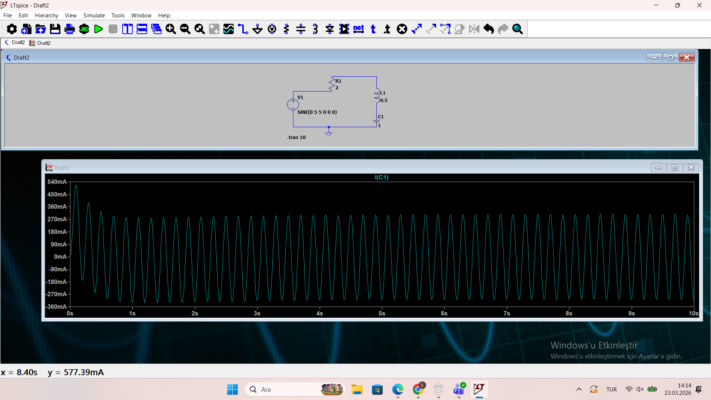
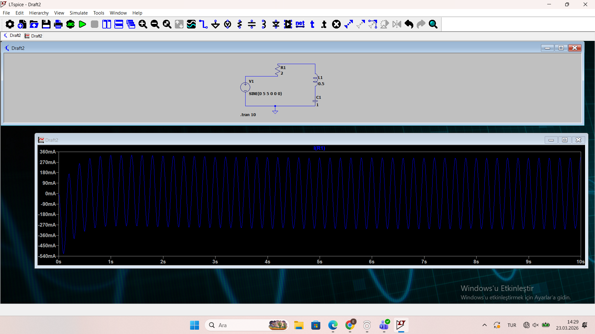

# Electrical–Mechanical Analogies: RLC and Mass-Spring-Damper Systems

Interdisciplinary case-study project between Electrical & Electronics Engineering and Mechanical Engineering, showing that a parallel **RLC circuit** and a **mass-spring-damper (MSD) system** are governed by the exact same second-order differential equation — and simulating both to prove it.

**Course:** EE202 – ME352 (Interdisciplinary Project), İzmir Institute of Technology (İYTE)

<p align="center">
  
</p>

## Overview

Using the **Force–Current (F–I) analogy**, current maps to force, voltage maps to velocity, and the circuit elements map to mechanical ones:

| Electrical | Mechanical |
|---|---|
| Current *i(t)* | Force *f(t)* |
| Voltage *V* | Velocity *v* |
| Capacitance *C* | Mass *m* |
| 1 / Resistance (1/R) | Damping coefficient *b* |
| 1 / Inductance (1/L) | Spring stiffness *k* |

The project works the conversion in both directions and validates each with simulation.

### Part 1 — Electrical → Mechanical

Starting from a parallel RLC circuit driven by a current source, we derive its node equation, simulate its step response in LTspice, convert it to an equivalent mass-spring-damper system via the F–I analogy, and validate the analogy with a MATLAB transfer-function step response and a Python analytical solution (displacement, velocity, acceleration).

- [`part1/rlc_step_response.asc`](part1/rlc_step_response.asc) — LTspice netlist, parallel RLC step response
- [`part1/task5_transfer_function_validation.m`](part1/task5_transfer_function_validation.m) — MATLAB transfer-function step response, validating the analogy
- [`part1/analytical_solution.py`](part1/analytical_solution.py) — Python closed-form solution for displacement/velocity/acceleration of the equivalent MSD system

### Part 2 — Mechanical → Electrical

Starting from a mass-spring-damper system driven by an external force, we derive its equation of motion, convert it to an equivalent parallel RLC circuit, simplify it to a single-mesh circuit via source transformation, and validate the result with MATLAB (`ode45`) and Python (Euler integration) simulations plus an LTspice transient analysis.

- [`part2/task2_ode45_simulation.m`](part2/task2_ode45_simulation.m) — MATLAB `ode45` simulation of the MSD system
- [`part2/task2_euler_simulation.py`](part2/task2_euler_simulation.py) — Python Euler-integration simulation of the same system
- [`images/part2-handwritten-derivation.jpg`](images/part2-handwritten-derivation.jpg) — hand-worked derivation of the equivalent circuit and its single-mesh simplification

<p align="center">
  
  
</p>

## Result

The LTspice current response and the analytical/numerical mechanical response show the same oscillation frequency, settling time, and decay envelope — confirming the electrical and mechanical systems are governed by the same differential equation, and that the source-transformation step used to simplify the circuit was correct.

## Repository contents

```
├── README.md
├── LICENSE
├── report/
│   └── Interdisciplinary-Project-Group-17-Report.pdf   # full write-up, all 5 tasks per part
├── part1/                                               # Electrical → Mechanical
│   ├── rlc_step_response.asc
│   ├── task5_transfer_function_validation.m
│   └── analytical_solution.py
├── part2/                                               # Mechanical → Electrical
│   ├── task2_ode45_simulation.m
│   └── task2_euler_simulation.py
└── images/
    ├── ltspice-capacitor-current.png
    ├── ltspice-resistor-current.png
    ├── ltspice-source-voltage.png
    └── part2-handwritten-derivation.jpg
```

The [full report](report/Interdisciplinary-Project-Group-17-Report.pdf) has the complete task-by-task derivation, equations, and all simulation plots for both parts.

## Team — Group 17

- Kerem Sezer
- Ömer Ege Nişli
- Bora Çiçek
- Ege Can
- Kasım Sözeri
- Ege Şengül
- Samet Ateş
- Emrehan Özay

## License

Released under the [MIT License](LICENSE).
